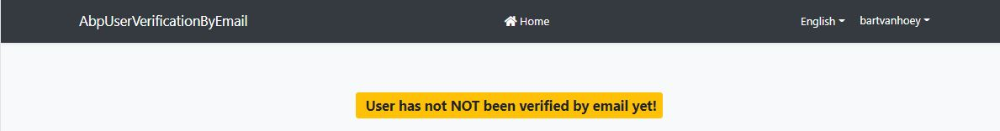
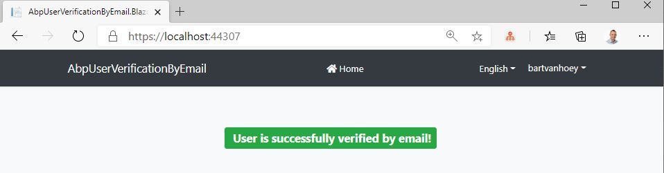

## Setup Email Confirmation on User Registration

## Introduction

In this article, I will show you how to get a user verified by email after he fills in the registration form in an **ABP Framework** application.

In this article I make use of the free **Google SMTP Server** for sending emails,  in a real-world application, however, you probably would choose another **Email Delivery Service** like **SendGrid, Mailjet, etc.**

### Source Code

The sample application has been developed with **Blazor** as UI framework and **SQL Server** as database provider.

The source code of the completed application is [available on GitHub](https://github.com/bartvanhoey/AbpUserVerificationByEmail).

## Requirements

The following tools are needed to be able to run the solution.

* .NET 6.0 SDK
* VsCode, Visual Studio 2022 or another compatible IDE
* ABP CLI version 6.0.0

You also need a **Gmail** account to follow along.

## Development

### Create a new Application

* Install or update the ABP CLI:

```bash
dotnet tool install -g Volo.Abp.Cli || dotnet tool update -g Volo.Abp.Cli
```

* Use the following ABP CLI command to create a new Blazor ABP application:

```bash
abp new AbpUserVerificationByEmail -u blazor -o AbpUserVerificationByEmail
```

### Open & Run the Application

* Open the solution in Visual Studio (or your favorite IDE).
* Run the `AbpUserVerificationByEmail.DbMigrator` application to apply the migrations and seed the initial data.
* Run the `AbpUserVerificationByEmail.HttpApi.Host` application to start the server-side.
* Run the `AbpUserVerificationByEmail.Blazor` application to start the Blazor UI project.

## Get your Google App Password

1. Navigate to wwww.google.com
2. Click on your **profile photo** of your **Google account** in the upper right corner of the page
3. Click Manage **your Google Account**
4. Click on the **Security** tab
5. In the **Signing in to Google** section, click on **App Passwords**. Enter your password and click Next
6. In the App passwords page, **Select app** (or Custom name) and **Select Device** (or Custom name)
7. Click **Generate** to generate your App password
8. Copy/paste your app password (remove blank spaces)

## Create a basic EmailService

### EmailService class

* Create a folder **Email** in the **Domain** project of your application.
* Add an **EmailService.cs** class to the **Email** folder. Copy/paste code below.

```csharp
using System.Threading.Tasks;
using Volo.Abp.DependencyInjection;
using Volo.Abp.Emailing;
using Volo.Abp.Security.Encryption;

namespace AbpUserVerificationByEmail.Domain.Email
{
    public class EmailService : ITransientDependency
    {
        private readonly IEmailSender _emailSender;
        public IStringEncryptionService _encryptionService { get; set; }

        public EmailService(IEmailSender emailSender) => _emailSender = emailSender;

        public async Task SendEmailAsync()
        {
            var encryptedGoogleAppPassword = _encryptionService.Encrypt("your-Google-App-Password-here");
            await _emailSender.SendAsync("recipient-email-here", "Email subject", "This is the email body...");
        }
    }
}
```

### CustomRegisterModel class

* Create a folder structure **Pages/Account** in the **HttpApi.Host** project of your application.
* Add a **RegisterModel.cs** file to the **Account** folder and paste in code below.

```csharp
using System.Threading.Tasks;
using AbpUserVerificationByEmail.Domain.Email;
using Volo.Abp.Account;
using Volo.Abp.Account.Web.Pages.Account;

namespace AbpUserVerificationByEmail.HttpApi.Host.Pages.Account
{
    public class CustomRegisterModel : RegisterModel
    {
        private readonly EmailService _emailService;

        public CustomRegisterModel(IAccountAppService accountAppService, EmailService emailService) : base(accountAppService) => _emailService = emailService;

        protected override async Task RegisterLocalUserAsync()
        {
            await _emailService.SendEmailAsync();
            await base.RegisterLocalUserAsync();
        }
    }
}
```

### Register.cshtml

* Add a **Register.cshtml** file to the **Account** folder.

```html
@page
@addTagHelper *, Microsoft.AspNetCore.Mvc.TagHelpers
@addTagHelper *, Volo.Abp.AspNetCore.Mvc.UI
@addTagHelper *, Volo.Abp.AspNetCore.Mvc.UI.Bootstrap
@addTagHelper *, Volo.Abp.AspNetCore.Mvc.UI.Bundling

@using Microsoft.AspNetCore.Mvc.Localization
@using Volo.Abp.Account.Localization

@model AbpUserVerificationByEmail.HttpApi.Host.Pages.Account.CustomRegisterModel
@inject IHtmlLocalizer<AccountResource> L

<div class="card mt-3 shadow-sm rounded">
    <div class="card-body p-5">
        @* <h4>@L["Register"]</h4> *@
        <h4>My Custom Register Page</h4>
        <strong>
            @L["AlreadyRegistered"]
            <a href="@Url.Page("./Login", new {returnUrl = Model.ReturnUrl, returnUrlHash = Model.ReturnUrlHash})" class="text-decoration-none">@L["Login"]</a>
        </strong>
        <form method="post" class="mt-4">
            @if (!Model.IsExternalLogin)
            {
                <abp-input asp-for="Input.UserName" auto-focus="true"/>
            }

            <abp-input asp-for="Input.EmailAddress"/>

            @if (!Model.IsExternalLogin)
            {
                <abp-input asp-for="Input.Password"/>
            }
            <abp-button button-type="Primary" type="submit" class="btn-lg btn-block mt-4">@L["Register"]</abp-button>
        </form>
    </div>
</div>
```

### Comment out the statement that injects class NullEmailSender in the **Domain** project

* In file **AbpUserVerificationByEmailDomainModule.cs**  comment out the statement below.

```csharp
// #if DEBUG
//    context.Services.Replace(ServiceDescriptor.Singleton<IEmailSender, NullEmailSender>());
// #endif
```

If we don't comment out the statement above, the application will not send emails as class NullEmailSender will be injected by the Dependency Injection.

### Get the encrypted Gmail password

* In the EmailService, set a breakpoint on the line *await _emailSender.SendAsync("...");*
* Replace *your-Google-App-Password-here* with your generate **Google App Password**.
* Replace *recipient-email-here* with your email address.
* Start both the **Blazor** and **HttpApi.Host** project to run the application.
* Navigate to the **Login** page and click on the  [Register](https://localhost:44367/) link.
* Fill in the form of the **My Custom Register Page** and click the **Register** button.
* Copy the value of the **encryptedGoogleAppPassword** when the breakpoint gets hit.
* Stop both the Blazor and the HttpApi.Host project.
* Open file **appsettings.json** in project **HttpApi.Host** and update the **Smtp Settings** with the correct values.
  
```json
"Settings": {
    "Abp.Mailing.Smtp.Host": "smtp.gmail.com",
    "Abp.Mailing.Smtp.Port": "587",
    "Abp.Mailing.Smtp.UserName": "your-gmail-email-address-here",
    "Abp.Mailing.Smtp.Password": "your-Google-App-Password-here",
    "Abp.Mailing.Smtp.Domain": "",
    "Abp.Mailing.Smtp.EnableSsl": "true",
    "Abp.Mailing.Smtp.UseDefaultCredentials": "false",
    "Abp.Mailing.DefaultFromAddress": "your-gmail-email-address-here",
    "Abp.Mailing.DefaultFromDisplayName": "Your-Custom-Text-Here"
  }
```

### Check if you can send and receive an email with the EmailService

* Remove the **IStringEncryptionService** from the **EmailService** class as no longer needed.

```csharp
public class EmailService : ITransientDependency
{
    private readonly IEmailSender _emailSender;

   public EmailService(IEmailSender emailSender) => _emailSender = emailSender;

    public async Task SendEmailAsync()
    {
      // TODO replace recipient-email-here
      await _emailSender.SendAsync("recipient-email-here", "Email subject", "This is the email body...");
    }
 }
```

* If you already registered the user, delete this user first in table **AbpUsers** in the database.
* Start both the **Blazor** and **HttpApi.Host** project to run the application.
* Navigate to the **Login** page again and click on the  [Register](https://localhost:44367/) link.
* Fill in the form of the **My Custom Register Page** and click the **Register** button.
* If all goes well, you should **receive an email** sent by the EmailService and the **user should have been registered**.

**WARNING**: Make sure you **don't publish** your **Google Credentials** to **GitHub** or **another Versioning System**.

## Change Index.razor of the Blazor project

* Open **Index.razor** and update **div class="container"** with the code below.

```html
<div class="container">
    <div class="p-5 text-center">
        @if (!CurrentUser.IsAuthenticated)
        {
            <Badge Color="Color.Danger" class="mb-4">
                <h5 class="m-1"> <i class="fas fa-email"></i> <strong>User is NOT Authenticated!</strong></h5>
            </Badge>
        }

        @if (CurrentUser.IsAuthenticated && !CurrentUser.EmailVerified)
        {
            <Badge Color="Color.Warning" class="mb-4">
                <h5 class="m-1"> <i class="fas fa-email"></i> <strong>User has not NOT been verified by email yet!</strong></h5>
            </Badge>
        }

        @if (CurrentUser.IsAuthenticated && CurrentUser.EmailVerified)
        {
            <Badge Color="Color.Success" class="mb-4">
                <h5 class="m-1"> <i class="fas fa-email"></i> <strong>User is successfully verified by email!</strong></h5>
            </Badge>
        }
    </div>
</div>
```

* Start both the **Blazor** and **HttpApi.Host** project to run the application.
* Go to the **Login** form and login with the credentials of the new user. The user is **logged in** but **not email verified**.



## Update SignIn IdentityOptions so a user has to confirm his email address

* Open file **AbpUserVerificationByEmailHttpApiModule.cs** in the **AbpUserVerificationByEmail.HttpApi.Host** project
* Add `ConfigureIdentityOptions(context);` as last statement in the **ConfigureServices** method.
* Add a private method **ConfigureIdentityOptions** just beneath the ****ConfigureServices**** method.
  
```csharp
// import using statements
using Microsoft.AspNetCore.Identity;
using Microsoft.Extensions.DependencyInjection;

public override void ConfigureServices(ServiceConfigurationContext context)
{
    ConfigureLocalization();
    ConfigureIdentityOptions(context);
}

private void ConfigureIdentityOptions(ServiceConfigurationContext context)
{
    context.Services.Configure<IdentityOptions>(options =>
    {
      options.SignIn.RequireConfirmedAccount = true;
      options.SignIn.RequireConfirmedEmail = true;
      options.SignIn.RequireConfirmedPhoneNumber = false;
    });
}
```

## Complete user registration flow

### Add `RegisterConfirmation` and `ConfirmEmail` pages to the Pages\Account folder of the **HttpApi.Host** project

* Create a new file **RegisterConfirmationModel.cs** to the **Pages\Account** folder and copy/paste the code below.
  
```csharp
using System.Text;
using System.Threading.Tasks;
using Microsoft.AspNetCore.Authorization;
using Microsoft.AspNetCore.Mvc;
using Microsoft.AspNetCore.Mvc.RazorPages;
using Microsoft.AspNetCore.WebUtilities;
using Volo.Abp.Emailing;
using Volo.Abp.Identity;

namespace AbpUserVerificationByEmail.HttpApi.Host.Pages.Account
{

  [AllowAnonymous]
  public class CustomRegisterConfirmationModel : PageModel
  {
    private readonly IdentityUserManager _userManager;
    private readonly IEmailSender _sender;
    public bool DisplayConfirmAccountLink { get; set; }
    public string EmailConfirmationUrl { get; set; }

    public CustomRegisterConfirmationModel(IdentityUserManager userManager, IEmailSender sender)
    {
      _userManager = userManager;
      _sender = sender;
    }

    public async Task<IActionResult> OnGetAsync(string email, string returnUrl = null)
    {
      if (email.IsNullOrWhiteSpace()) return RedirectToPage("/Index");

      var user = await _userManager.FindByEmailAsync(email);
      if (user == null) return NotFound($"Unable to load user with email '{email}'.");

      // TODO Set to true if you want to display the Account/ConfirmEmail page
      DisplayConfirmAccountLink = false;
      if (DisplayConfirmAccountLink)
      {
        var userId = await _userManager.GetUserIdAsync(user);
        var code = await _userManager.GenerateEmailConfirmationTokenAsync(user);
        code = WebEncoders.Base64UrlEncode(Encoding.UTF8.GetBytes(code));
        EmailConfirmationUrl = Url.Page(
            "/Account/ConfirmEmail",
            pageHandler: null,
            values: new { userId = userId, code = code },
            protocol: Request.Scheme);
      }
      return Page();
    }
  }
}
```

* Create a new file **RegisterConfirmation.cshtml** to the **Pages\Account**  folder and copy/paste the code below.

```html
@page
@model AbpUserVerificationByEmail.HttpApi.Host.Pages.Account.CustomRegisterConfirmationModel
@{
    ViewData["Title"] = "Register confirmation";
}

<div class="card mt-3 shadow-sm rounded">
    <div class="card-body p-5">
        <h4>@ViewData["Title"]</h4>
        @{
            if (@Model.DisplayConfirmAccountLink)
            {
                <p>
                    This app does not currently have a real email sender registered, see <a
                        href="https://aka.ms/aspaccountconf">these docs</a> for how to configure a real email sender.
                    Normally this would be emailed: <a id="confirm-link" href="@Model.EmailConfirmationUrl">Click here to
                        confirm your account</a>
                </p>
            }
            else
            {
                <p>
                    Please check your email to confirm your account.
                </p>
            }
        }
    </div>
</div>
```  

* Create a new file **ConfirmEmailModel.cs** to the **Pages\Account** folder and copy/paste the code below.

```csharp
using System;
using System.Text;
using System.Threading.Tasks;
using Microsoft.AspNetCore.Authorization;
using Microsoft.AspNetCore.Mvc;
using Microsoft.AspNetCore.Mvc.RazorPages;
using Microsoft.AspNetCore.WebUtilities;
using Volo.Abp.Identity;

namespace AbpUserVerificationByEmail.HttpApi.Host.Pages.Account
{
    [AllowAnonymous]
    public class CustomConfirmEmailModel : PageModel
    {
        private readonly IdentityUserManager _userManager;

        public CustomConfirmEmailModel(IdentityUserManager userManager) => _userManager = userManager;

        public async Task<IActionResult> OnGetAsync(string userId, string code)
        {
            if (userId.IsNullOrWhiteSpace()|| code.IsNullOrWhiteSpace()) return RedirectToPage("/Index");

            var user = await _userManager.FindByIdAsync(userId);
            if (user == null) return NotFound($"Unable to load user with ID '{userId}'.");

            code = Encoding.UTF8.GetString(WebEncoders.Base64UrlDecode(code));
            var result = await _userManager.ConfirmEmailAsync(user, code);
            return Page();
        }
    }
}
```

* Create a new file **ConfirmEmail.cshtml** to the **Pages\Account** folder and copy/paste the code below.

```html
@page
@model AbpUserVerificationByEmail.HttpApi.Host.Pages.Account.CustomConfirmEmailModel
@{
    ViewData["Title"] = "Email Confirmed";
}

<div class="card mt-3 shadow-sm rounded">
    <div class="card-body p-5">
        <h4>@ViewData["Title"]</h4>
        <hr>
        Email Successfully Confirmed
    </div>
</div>
```  

### Update file RegisterModel.cs in HttpApi.Host project

```csharp
using System.Linq;
using System.Text;
using System.Text.Encodings.Web;
using System.Threading.Tasks;
using Microsoft.AspNetCore.Identity;
using Microsoft.AspNetCore.Mvc;
using Microsoft.AspNetCore.WebUtilities;
using Microsoft.Extensions.Logging;
using Microsoft.Extensions.Options;
using Volo.Abp;
using Volo.Abp.Account;
using Volo.Abp.Account.Web.Pages.Account;
using Volo.Abp.Emailing;

namespace AbpUserVerificationByEmail.HttpApi.Host.Pages.Account
{
  public class CustomRegisterModel : RegisterModel
  {
    private readonly IAccountAppService _accountAppService;
    private readonly IEmailSender _emailSender;
    private Volo.Abp.Identity.IdentityUser _abpIdentityUser;

    public CustomRegisterModel(IAccountAppService accountAppService, IEmailSender emailSender) : base(accountAppService)
    {
      _emailSender = emailSender;
      _accountAppService = accountAppService;
    }

    public override async Task<IActionResult> OnPostAsync()
    {
      try
      {
        await CheckSelfRegistrationAsync();

        if (IsExternalLogin)
        {
          var externalLoginInfo = await SignInManager.GetExternalLoginInfoAsync();
          if (externalLoginInfo == null)
          {
            Logger.LogWarning("External login info is not available");
            return RedirectToPage("./Login");
          }
          await RegisterExternalUserAsync(externalLoginInfo, Input.EmailAddress);
        }
        else
        {
          await RegisterLocalUserAsync();
        }

        if (UserManager.Options.SignIn.RequireConfirmedAccount)
        {
          return RedirectToPage("RegisterConfirmation", new { email = Input.EmailAddress, returnUrl = ReturnUrl });
        }
        else
        {
          await SignInManager.SignInAsync(_abpIdentityUser, isPersistent: true);
          return LocalRedirect(ReturnUrl);
        }
       // return Redirect(ReturnUrl ?? "~/"); //TODO: How to ensure safety? IdentityServer requires it however it should be checked somehow!
      }
      catch (BusinessException e)
      {
        Alerts.Danger(e.Message);
        return Page();
      }
    }

    protected override async Task RegisterLocalUserAsync()
    {
      ValidateModel();

      var userDto = await AccountAppService.RegisterAsync(
          new RegisterDto
          {
            AppName = "YourAppName Here",
            EmailAddress = Input.EmailAddress,
            Password = Input.Password,
            UserName = Input.UserName
          }
      );

      _abpIdentityUser = await UserManager.GetByIdAsync(userDto.Id);

      // Send user an email to confirm email address      
      await SendEmailToAskForEmailConfirmationAsync(_abpIdentityUser);
    }

    protected override async Task RegisterExternalUserAsync(ExternalLoginInfo externalLoginInfo, string emailAddress)
    {
      await IdentityOptions.SetAsync();

      var user = new Volo.Abp.Identity.IdentityUser(GuidGenerator.Create(), emailAddress, emailAddress, CurrentTenant.Id);

      (await UserManager.CreateAsync(user)).CheckErrors();
      (await UserManager.AddDefaultRolesAsync(user)).CheckErrors();

      var userLoginAlreadyExists = user.Logins.Any(x =>
          x.TenantId == user.TenantId &&
          x.LoginProvider == externalLoginInfo.LoginProvider &&
          x.ProviderKey == externalLoginInfo.ProviderKey);

      if (!userLoginAlreadyExists)
      {
        (await UserManager.AddLoginAsync(user, new UserLoginInfo(
            externalLoginInfo.LoginProvider,
            externalLoginInfo.ProviderKey,
            externalLoginInfo.ProviderDisplayName
        ))).CheckErrors();
      }

      await SendEmailToAskForEmailConfirmationAsync(user);
    }


    private async Task SendEmailToAskForEmailConfirmationAsync(Volo.Abp.Identity.IdentityUser user)
    {
      var code = await UserManager.GenerateEmailConfirmationTokenAsync(user);
      code = WebEncoders.Base64UrlEncode(Encoding.UTF8.GetBytes(code));
      var callbackUrl = Url.Page("/Account/ConfirmEmail", pageHandler: null, values: new { userId = user.Id, code = code }, protocol: Request.Scheme);

      // TODO use EmailService instead of using IEmailSender directly
      await _emailSender.SendAsync(Input.EmailAddress, "Confirm your email",
          $"Please confirm your account by <a href='{HtmlEncoder.Default.Encode(callbackUrl)}'>clicking here</a>.");
    }

  }
}
```

## Test Registration flow and User Email Verification

* If you already registered a user, delete it first in table **AbpUsers** in the database.
* Start both the **Blazor** and **HttpApi.Host** project to run the application.
* Navigate to the **Login** page and click on the  [Register](https://localhost:44367/) link.
* Fill in the form of the **My Custom Register Page** and click the **Register** button.
* Go to your email inbox and click on the [clicking here](https://localhost:44367/) link to confirm your account.
* Navigate to the **Login** page and enter your credentials. Click **Login**.

Et voilà! This is the result. **The user's email address is successfully verified**!



You can now force a user to confirm his email address before he can use your application.

Click on the links to find more about [Sending Emails](https://docs.abp.io/en/abp/latest/Emailing) and the [Account Module](https://docs.abp.io/en/abp/latest/Modules/Account)

Get the [source code](https://github.com/bartvanhoey/AbpUserVerificationByEmail) on GitHub.

Enjoy and have fun!
